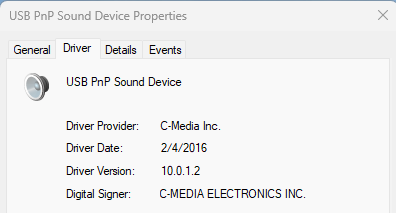

# CM108-USB-PnP-Sound-Device-Win11-Driver

```
https://github.com/ChemicalAvocado/CM108-USB-PnP-Sound-Device-Win11-Driver/releases/download/v10.0.1.2/CM108-Drv-v10.0.1.2.zip
```

## Background
This USB sound card is usable in win11 without manual driver installation, however Volume Control, Mute of windows will not be reflected in the output as well as DTS / AC3 encoded audio will not able to output as bitstream.
After some googling, found driver has no longer downloadable from official site. And found that is the latest version from internet works seamlessly on win11.

## Device VID/PID
```
USB\VID_0D8C&PID_013C&MI_00
```

## Device Outfit


## Driver Version


## Supported Format


## Other References
```
https://github.com/islandcontroller/fiberaudio-108?tab=readme-ov-file
```
