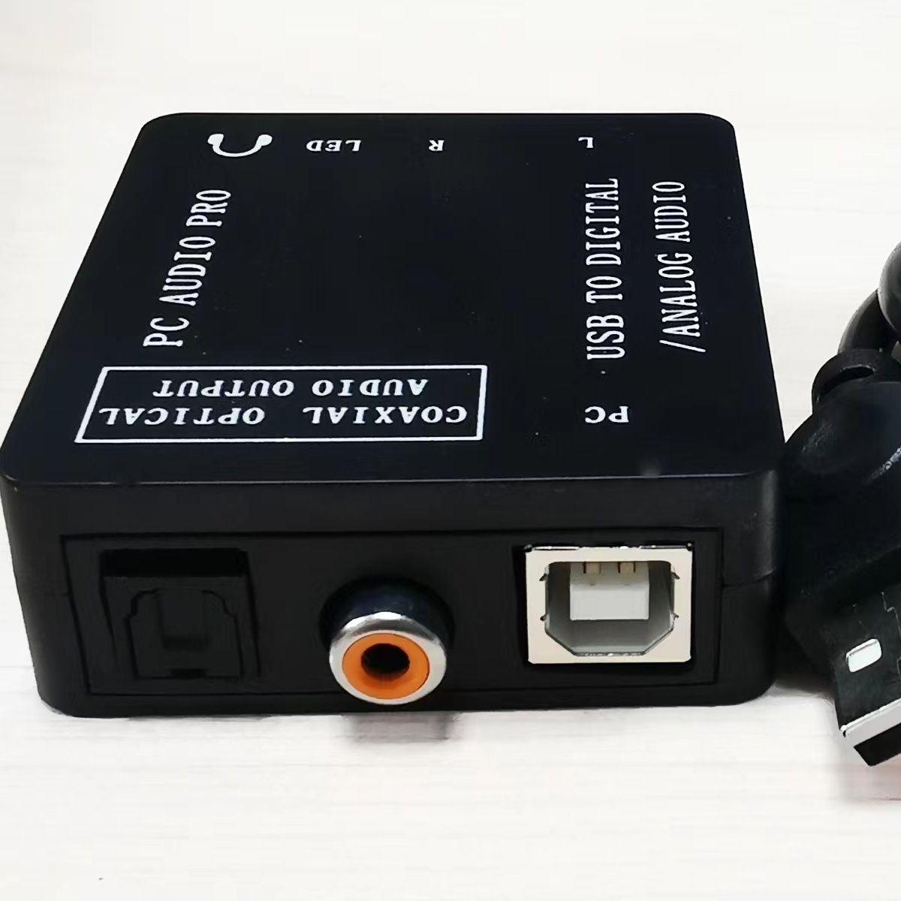
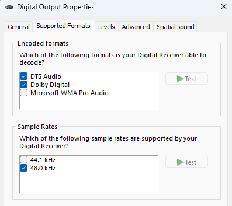

# CM108-USB-PnP-Sound-Device-Win11-Driver

## Background of this driver.
This USB sound card is usable in win11 without manual driver installation, however Volume Control, Mute of windows will not be reflected in the output as well as DTS / AC3 encoded audio will not able to output as bitstream.
After some google and GenAI, driver is no longer downloadable from offical site. And found that is the latest version that can seamless support win11.

## Device VID/PID
```
USB\VID_0D8C&PID_013C&MI_00
```

## Device Outfit


## Driver Version


## Supported Format


## Other References
```
https://github.com/islandcontroller/fiberaudio-108?tab=readme-ov-file
```
